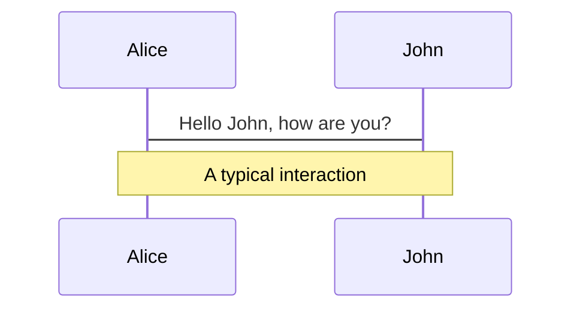
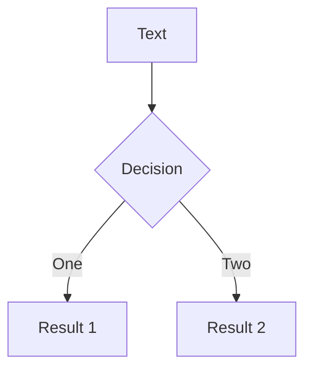

<<<<<<< HEAD
# Sintaxis de Markdown

Las diapositivas se escriben dentro de **un único archivo markdown** (por defecto `./slides.md`). 

Puedes utilizar [las características de Markdown](https://github.com/adam-p/markdown-here/wiki/Markdown-Cheatsheet) como lo harías normalmente, con soporte adicional de HTML en línea y componentes de Vue. También se admite el estilo utilizando [Windi CSS](https://windicss.org). Utiliza `---` separado con una nueva línea para dividir tus diapositivas. 
=======
---
outline: deep
---

# Markdown Syntax

Slides are written within **a single markdown file** (by default `./slides.md`).

You can use [the Markdown features](https://github.com/adam-p/markdown-here/wiki/Markdown-Cheatsheet) as you normally would, with the additional support of inlined HTML and Vue Components. Styling using [UnoCSS](/custom/config-unocss) is also supported. Use `---` padded with a new line to separate your slides.
>>>>>>> 21fdadc17cd2018f65c637e5727de640db5036e3

````md
# Slidev

¡Hola, mundo!

---

# Página 2

Usa directamente bloques de código para el resaltado

<<<<<<< HEAD
//```ts
console.log('¡Hola, mundo!')
//```
=======
```ts
console.log('Hello, World!')
```
>>>>>>> 21fdadc17cd2018f65c637e5727de640db5036e3

---

# Página 3

Puedes utilizar directamente Windi CSS y los componentes de Vue para estilizar y enriquecer tus diapositivas.

<div class="p-3">
  <Tweet id="20" />
</div>
````

<<<<<<< HEAD
## Front Matter y plantillas

Puedes especificar plantillas y otros metadatos para cada diapositiva convirtiendo los separadores en [bloques de Front Matter](https://jekyllrb.com/docs/front-matter/). Cada bloque de entrada comienza con un guión triple y termina con otro. Los textos entre ellos son objetos de datos en formato [YAML](https://www.cloudbees.com/blog/yaml-tutorial-everything-you-need-get-started/). Por ejemplo:
=======
## Frontmatter & Layouts

Specify layouts and other metadata for each slide by converting the separators into [frontmatter blocks](https://jekyllrb.com/docs/front-matter/). Each frontmatter starts with a triple-dash and ends with another. Texts between them are data objects in [YAML](https://www.cloudbees.com/blog/yaml-tutorial-everything-you-need-get-started/) format. For example:
>>>>>>> 21fdadc17cd2018f65c637e5727de640db5036e3

<!-- eslint-skip -->

```md
---
layout: cover
---

# Slidev

Esta es la página de portada

---
<<<<<<< HEAD
layout: centrado
background: './images/background-1.png'
=======
layout: center
background: /background-1.png
>>>>>>> 21fdadc17cd2018f65c637e5727de640db5036e3
class: 'text-white'
---

# Página 2

Esta es una página con la plantilla `centrado` y una imagen de fondo.

---

# Página 3

<<<<<<< HEAD
Esta es la página por defecto sin ningún metadato adicional.
~~~
=======
This is a default page without any additional metadata.
```
>>>>>>> 21fdadc17cd2018f65c637e5727de640db5036e3

Revisa la [página de personalización](/custom/) para más detalles.

<<<<<<< HEAD
## Bloques de código

Una gran razón por la que estoy construyendo Slidev es la necesidad de hacer que mi código se vea bien en las diapositivas. Así que, tal y como esperabas, puedes utilizar el bloque de código de estilo Markdown para resaltar tu código.
=======
### Prettier Support

> Available since v0.44

The custom syntax might not be compactible with some formatters like Prettier.
You can either install the [Prettier Plugin](/guide/editors#prettier-plugin) or use a direct `yaml` code block to define the frontmatter instead:

````md
---
layout: cover
---

# Slidev

This is the cover page.

---

```yaml
# The first yaml block will be treated as the frontmatter of that slide
layout: center
background: /background-1.png
class: 'text-white'
```

# Page 2

This is a page with the layout `center` and a background image.
````

## Code Blocks

One big reason that led to the creation of Slidev was the need to perfectly display code in slides. Consequently, you can use Markdown-flavored code blocks to highlight your code.
>>>>>>> 21fdadc17cd2018f65c637e5727de640db5036e3

````md
```ts
console.log('Hello, World!')
```
````

<<<<<<< HEAD
Damos soporte a [Prism](http://prismjs.com) y [Shiki](https://github.com/shiki/shiki) como resaltadores de sintaxis. Revisa la [sección de resaltadores](/custom/highlighters) para más detalles.
=======
Slidev has [Shiki](https://github.com/shikijs/shiki) built in as the syntax highlighter. Refer to [the highlighters section](/custom/highlighters) for more details.
>>>>>>> 21fdadc17cd2018f65c637e5727de640db5036e3

### Resaltado de línea

<<<<<<< HEAD
Para resaltar líneas específicas, simplemente añade los números de línea dentro del paréntesis `{}`. Los números de línea empiezan a contar desde 1.

~~~ts
//```ts {2,3}
function sumar(
=======
To highlight specific lines, simply add line numbers within brackets `{}`. Line numbers start counting from 1 by default.

````md
```ts {2,3}
function add(
>>>>>>> 21fdadc17cd2018f65c637e5727de640db5036e3
  a: Ref<number> | number,
  b: Ref<number> | number
) {
  return computed(() => unref(a) + unref(b))
}
```
````

<<<<<<< HEAD
Para cambiar el resaltado en varios pasos, puede utilizar `|` para separarlos. Por ejemplo
~~~ts
//```ts {2-3|5|all}
function sumar(
=======
To change what's highlighted with multiple clicks, you can use `|` to separate each stage:

````md
```ts {2-3|5|all}
function add(
>>>>>>> 21fdadc17cd2018f65c637e5727de640db5036e3
  a: Ref<number> | number,
  b: Ref<number> | number
) {
  return computed(() => unref(a) + unref(b))
}
```
````

<<<<<<< HEAD
Esto resaltará primero `a: Ref<number> | number` y `b: Ref<number> | number`, y después `return computed(() => unref(a) + unref(b))` tras un clic, y finalmente, todo el bloque. Aprende más en la [guía de animaciones de clics](/guide/animations).

Para omitir el resaltado de cualquier línea, puedes establecer el número de línea en `0`. Por ejemplo:

~~~ts {0}
//```ts {0}
function suma(
=======
This will first highlight `a: Ref<number> | number` and `b: Ref<number> | number`, and then `return computed(() => unref(a) + unref(b))` after one click, and lastly, the whole block.

You can set the line number to `hide` to hide the code block or `none` to not highlight any line:

````md
```ts {hide|none}
function add(
>>>>>>> 21fdadc17cd2018f65c637e5727de640db5036e3
  a: Ref<number> | number,
  b: Ref<number> | number
) {
  return computed(() => unref(a) + unref(b))
}
```
````

<<<<<<< HEAD
Si el código no cabe en una diapositiva, puedes añadir la opción `maxHeight que establecerá una altura fija y permitirá el desplazamiento:

~~~ts {2|3|7|12}
//```ts {2|3|7|12} {maxHeight:'100px'}
function suma(
=======
::: tip
Learn more in the [click animations guide](./animations#positioning).
:::

### Line Numbers

You can enable line numbering for all slides by setting `lineNumbers: true` in the global config or enable each code block individually by setting `lines: true`. You can also set the starting line for each code block and highlight the lines accordingly; it defaults to 1:

````md
```ts {6,7}{lines:true,startLine:5}
function add(
  a: Ref<number> | number,
  b: Ref<number> | number
) {
  return computed(() => unref(a) + unref(b))
}
```
````

### Max Height

If the code doesn't fit into one slide, you use the `maxHeight` to set fixed height and enable scrolling:

````md
```ts {2|3|7|12}{maxHeight:'100px'}
function add(
>>>>>>> 21fdadc17cd2018f65c637e5727de640db5036e3
  a: Ref<number> | number,
  b: Ref<number> | number
) {
  return computed(() => unref(a) + unref(b))
}
<<<<<<< HEAD
/// ...tantas líneas como desees
const c = suma(1, 2)
//```
~~~
=======
/// ...as many lines as you want
const c = add(1, 2)
```
````

### TwoSlash Integration

> Available since v0.46

This feature is only available when you [set `highlighter` to `shiki`](/custom/highlighters)

[TwoSlash](https://twoslash.netlify.app/) is a powerful tool for rendering TypeScript code blocks with type information on hover or inlined. It's quite useful for preparing slides for JavaScript/TypeScript-related topics.

To use it, you can add `twoslash` to the code block's language identifier:

````md
```ts twoslash
import { ref } from 'vue'

const count = ref(0)
//            ^?
```
````

It will be rendered as:

```ts twoslash
import { ref } from 'vue'

const count = ref(0)
//            ^?
```

<!-- For the popup to not to overlap the content below -->
<div class="py-20" />

### Shiki Magic Move

> Available since v0.48

[Shiki Magic Move](https://github.com/shikijs/shiki-magic-move) enables you to have granular transition between code changes, similar to Keynote's Magic Move. You can check [the playground](https://shiki-magic-move.netlify.app/) to see how it works.

<video src="https://github.com/slidevjs/slidev/assets/11247099/79927794-27ba-4342-9911-9996cec889d6" controls rounded shadow w-full></video>

In Slidev, we bind the magic-move to the [clicks system](/guide/animations#click-animations). The syntax is to wrap multiple code blocks representing each step with <code>````md magic-move</code> (mind it's **4** backticks), this will be transformed into one code block, that morphs to each step as you click.

`````md
````md magic-move
```js
console.log(`Step ${1}`)
```
```js
console.log(`Step ${1 + 1}`)
```
```ts
console.log(`Step ${3}` as string)
```
````
`````

It's also possible to mix Magic Move with [line highlighting](#line-highlighting) and [line numbers](#line-numbers), for example:

`````md
````md magic-move {at:4, lines: true} // [!code hl]
```js {*|1|2-5} // [!code hl]
let count = 1
function add() {
  count++
}
```

Non-code blocks in between as ignored, you can put some comments.

```js {*}{lines: false} // [!code hl]
let count = 1
const add = () => count += 1
```
````
`````

<!-- TODO: add an inline demo -->
>>>>>>> 21fdadc17cd2018f65c637e5727de640db5036e3

### Editor de Monaco


Cuando quieras hacer alguna modificación en la presentación, simplemente añade `{monaco}` después del identificador del lenguaje - ¡se convierte todo el bloque en un editor de Monaco con todas las funciones!

<<<<<<< HEAD
~~~ts
//```ts {monaco}
console.log('HolaMundo')
//```
~~~
=======
````md
```ts {monaco}
console.log('HelloWorld')
```
````
>>>>>>> 21fdadc17cd2018f65c637e5727de640db5036e3

Lea más sobre [configurar Monaco](/custom/config-monaco).

<<<<<<< HEAD
## Estilos incrustados
=======
#### Monaco Diff

Monaco can also generate a diff between two code blocks. Use `{monaco-diff}` to turn the block into a [diff Monaco editor](https://microsoft.github.io/monaco-editor/playground.html?source=v0.36.1#example-creating-the-diffeditor-multi-line-example) and use `~~~` to separate both original and modified version of the code!

````md
```ts {monaco-diff}
This line is removed on the right.
just some text
abcd
efgh
Some more text
~~~
just some text
abcz
zzzzefgh
Some more text.
This line is removed on the left.
```
````

It provides the editor with a "Run" button, and shows the result of the code execution right below the code block. You may also modify the code and the result will be re-evaluated on the fly.

By default it will automatically run the code when the slide is loaded; if you want to instead explicitly trigger the run, you can set `{autorun:false}`.

````md
```ts {monaco-run} {autorun:false}
console.log('Click the play button to run me')
```
````

If you want to only show the output in certain clicks, you can use the `showOutputAt` prop. The value is the same as `v-click`.

````md
```ts {monaco-run} {showOutputAt:'+1'}
console.log('Shown after 1 click')
```
````

Currently Slidev supports running JavaScript and TypeScript code out-of-box. Refer to [Custom Code Runners](/custom/config-code-runners) for custom languages support.

#### Writable Monaco Editor

> Available since v0.49.5

You can also use the [Import Code Snippets](#import-code-snippets) syntax combining with the `{monaco-write}` directive, to link your Monaco Editor with a file on your filesystem. This will allow you to edit the code directly in the editor and save the changes back to the file.

```md
<<< ./some-file.ts {monaco-write}
```

When using this, be sure to back up your files beforehand, as the changes will be saved directly to the file.

## Embedded Styles
>>>>>>> 21fdadc17cd2018f65c637e5727de640db5036e3

Puedes usar la etiqueta `<style>` en tu Markdown directamente para sobreescribir los estilos de la **diapositiva actual**.

```md
# Esto es rojo

<style>
h1 {
  color: red
}
</style>

---

# La siguiente diapositiva no se ve afectada
```

<<<<<<< HEAD
La etiqueta `<style>` en Markdown tiene siempre [alcance local](https://vuejs.org/api/sfc-css-features.html#scoped-css). Como resultado destacado, un selector con el combinador hijo (`.a > .b`) es inutilizable como tal; consulta el enlace anterior. Para tener anulaciones de estilo globales, consulta la [sección de personalización](/custom/directory-structure#style).

Gracias a [Windi CSS](https://windicss.org), puedes usar CSS anidado y [directivas](https://windicss.org/features/directives.html) (por `@apply`)
=======
The `<style>` tag in Markdown is always [scoped](https://vuejs.org/api/sfc-css-features.html#scoped-css). As a result, a selector with a child combinator (`.a > .b`) is unusable as such; see the previous link. To have global style overrides, check out the [customization section](/custom/directory-structure#style).

Powered by [UnoCSS](/custom/config-unocss), you can directly use nested css and [directives](https://unocss.dev/transformers/directives) (e.g. `--uno:` or `@apply`)
>>>>>>> 21fdadc17cd2018f65c637e5727de640db5036e3

```md
# Slidev

> Hello `world`

<style>
blockquote {
  code {
    --uno: text-teal-500 dark:text-teal-400;
  }
}
</style>
```

## Recursos estáticos

Al igual que harías en markdown, puedes utilizar imágenes que apunten a una url remota o local.

<<<<<<< HEAD
Para los recursos remotos, [`vite-plugin-remote-assets`](https://github.com/antfu/vite-plugin-remote-assets) los almacenará en caché tras la primera ejecución para que puedan tener una carga instantánea incluso para las imágenes más pesadas.
=======
For remote assets, the built-in [`vite-plugin-remote-assets`](https://github.com/antfu/vite-plugin-remote-assets) will cache them onto the disk at first run, ensuring instant loading even for large images later on.
>>>>>>> 21fdadc17cd2018f65c637e5727de640db5036e3

```md

```

Para recursos locales, muévelos a [la carpeta `public`](/custom/directory-structure.html#public) y referéncialos con una **barrita** (`/`).

```md

```

<<<<<<< HEAD
Si deseas aplicar tamaños o estilos personalizados, puedes convertirlos a la etiqueta ``: 
=======
For you want to apply custom sizes or styles, you can convert them to the `` tag
>>>>>>> 21fdadc17cd2018f65c637e5727de640db5036e3

```html

```

## Notas

<<<<<<< HEAD
También puedes tomar notas para cada diapositiva. Se mostrarán en el [Modo Presentador](/guide/presenter-mode) para que puedas consultarlas durante las presentaciones.
=======
You can also create presenter notes for each slide. They will show up in [Presenter Mode](/guide/presenter-mode) for you to reference during presentations.
>>>>>>> 21fdadc17cd2018f65c637e5727de640db5036e3

En Markdown, el último bloque de comentarios de cada diapositiva será tratado como una nota.

```md
---
layout: cover
---

# Página 1

Esta es la página de la portada.

<!-- Esto es una nota -->

---

# Página 2

<!-- Esto NO es una nota porque precede al contenido de la diapositiva -->

La segunda página

<!--
Esta es otra nota
-->
```

Basic Markdown and HTML are also supported in notes when the Presenter renders note content.

### Click Markers

> Available since v0.48

For some slides you might have longer notes that could be hard to find your place. Slidev supports click markers that allow highlighting and auto-scrolling to the section of notes from your corresponding content. Put `[click]` markers at the beginning of any line in your notes for the timing you need to go to another [click](/guide/animations#click-animations). You may skip `n` clicks by using `[click:{n+1}]`. For example:

```md
<!--
Content before the first click

[click] This will be highlighted after the first click

Also highlighted after the first click

- [click] This list element will be highlighted after the second click

[click:3] Last click (skip two clicks)
-->
```

Slidev divides the content between the click markers and highlights it in presenter notes, synchronized with your slide progress.

<!-- TODO: add a video -->

## Iconos

<<<<<<< HEAD
Slidev te permite tener acceso a casi todos los conjuntos de iconos populares de código abierto **directamente** en tu markdown. Potenciado por [`unplugin-icons`](https://github.com/antfu/unplugin-icons) e [Iconify](https://iconify.design/).

El nombrado sigue la convención de [Iconify](https://iconify.design/): `{collection-name}-{icon-name}`. Por ejemplo:

- `<mdi-account-circle />` - <mdi-account-circle /> de [Material Design Icons](https://github.com/Templarian/MaterialDesign)
- `<carbon-badge />` - <carbon-badge /> de [Carbon](https://github.com/carbon-design-system/carbon/tree/main/packages/icons)
- `<uim-rocket />` - <uim-rocket /> de [Unicons Monochrome](https://github.com/Iconscout/unicons)
- `<twemoji-cat-with-tears-of-joy />` - <twemoji-cat-with-tears-of-joy /> de [Twemoji](https://github.com/twitter/twemoji)
- `<logos-vue />` - <logos-vue /> de [SVG Logos](https://github.com/gilbarbara/logos)
- Y mucho más...
=======
Slidev allows you to have access to virtually all open-source icon sets **directly** in your markdown after installing the corresponding package. Powered by [`unplugin-icons`](https://github.com/antfu/unplugin-icons) and [Iconify](https://iconify.design/).

The naming follows [Iconify](https://iconify.design/)'s convention of `{collection-name}-{icon-name}`. For example:

- `<mdi-account-circle />` - <mdi-account-circle /> from [Material Design Icons](https://github.com/Templarian/MaterialDesign) - [`@iconify-json/mdi`](https://npmjs.com/package/@iconify-json/mdi)
- `<carbon-badge />` - <carbon-badge /> from [Carbon](https://github.com/carbon-design-system/carbon/tree/main/packages/icons) - [`@iconify-json/carbon`](https://npmjs.com/package/@iconify-json/carbon)
- `<uim-rocket />` - <uim-rocket /> from [Unicons Monochrome](https://github.com/Iconscout/unicons) - [`@iconify-json/uim`](https://npmjs.com/package/@iconify-json/uim)
- `<twemoji-cat-with-tears-of-joy />` - <twemoji-cat-with-tears-of-joy /> from [Twemoji](https://github.com/twitter/twemoji) - [`@iconify-json/twemoji`](https://npmjs.com/package/@iconify-json/twemoji)
- `<logos-vue />` - <logos-vue /> from [SVG Logos](https://github.com/gilbarbara/logos) - [`@iconify-json/logos`](https://npmjs.com/package/@iconify-json/logos)
- And much more...
>>>>>>> 21fdadc17cd2018f65c637e5727de640db5036e3

Puedes navegar y buscar todos los iconos con [Icônes](https://icones.js.org/).

### Estilizando iconos

Puedes estilizar los iconos tal y como estilizarías un elemento HTML. Por ejemplo:

```html
<uim-rocket />
<uim-rocket class="text-3xl text-red-400 mx-2" />
<uim-rocket class="text-3xl text-orange-400 animate-ping" />
```

<uim-rocket />
<uim-rocket class="text-3xl text-red-400 mx-2" />
<uim-rocket class="text-3xl text-orange-400 animate-ping ml-2" />

## Slots

> Disponible desde v0.18

Algunas plantillas pueden proporcionar múltiples puntos de contribución utilizando [los `<slots>` nombrados de Vue](https://v3.vuejs.org/guide/component-slots.html).

Por ejemplo, en una estructura de [dos columnas](https://github.com/slidevjs/slidev/blob/main/packages/client/layouts/two-cols.vue), puede tener dos columnas a la izquierda (slot `default`) y a la derecha (slot `right`) una al lado de la otra.

```md
---
layout: two-cols
---

<template v-slot:default>

# Izquierda

Esto muestra a la izquierda

</template>
<template v-slot:right>

# Derecha

Esto se muestra a la derecha

</template>
```

<div class="grid grid-cols-2 rounded border border-gray-400 border-opacity-50 px-10 pb-4">
<div>
<h3>Izquierda</h3>
<p>Esto se muestra a la izquierda</p>
</div>
<div>
<h3>Derecha</h3>
<p>Esto se muestra a la derecha</p>
</div>
</div>

<<<<<<< HEAD
También proporcionamos una sintaxis abreviada (`::nombre::`) para el nombre del slot. El siguiente ejemplo funciona exactamente igual que el anterior.
=======
We also provide a shorthand syntactical sugar `::name::` for slot name. The following works exactly the same as the previous example.
>>>>>>> 21fdadc17cd2018f65c637e5727de640db5036e3

```md
---
layout: two-cols
---

# Izquierda

Esto muestra a la izquierda

::right::

# Derecha

Esto se muestra a la derecha
```

<<<<<<< HEAD
También puede especificar explícitamente el slot por defecto y proporcionar un orden personalizado
=======
You can also explicitly specify the default slot and provide in the custom order.
>>>>>>> 21fdadc17cd2018f65c637e5727de640db5036e3

```md
---
layout: two-cols
---

::right::

# Derecha

Esto se muestra a la derecha

::default::

# Izquierda

Esto muestra a la izquierda
```

<<<<<<< HEAD
## Configuraciones

Todas las configuraciones necesarias se pueden definir en el archivo Markdown. Por ejemplo:
=======
## Import Code Snippets

> Available since v0.47.0

You can import code snippets from existing files via following syntax:

```md
<<< @/snippets/snippet.js
```

::: tip
The value of `@` corresponds to the source root, the directory where the `slides.md` is located.
:::

This feature is vendored from VitePress, learn more about it in [VitePress's documentation](https://vitepress.dev/guide/markdown#import-code-snippets).

## Configurations

All configurations can be defined in the Markdown file. For example:
>>>>>>> 21fdadc17cd2018f65c637e5727de640db5036e3

```md
---
theme: seriph
layout: portada
background: 'https://source.unsplash.com/1600x900/?nature,water'
---

# Slidev

Esta es la página de la portada
```

Lee más sobre la [configuración de Front Matter](/custom/#frontmatter-configures).

## LaTeX

Slidev viene con soporte integrado de LaTex, gracias a [KaTeX](https://katex.org/).

<TheTweet id="1392246507793915904" />

### En líneas

Rodea tu LaTeX con un solo `$` a cada lado para la representación en línea.

```md
$\sqrt{3x-1}+(1+x)^2$
```

### Bloque

Utiliza dos (`$$`) para la representación de bloques. Este modo utiliza símbolos más grandes y centra el resultado.

```latex
$$
\begin{array}{c}

\nabla \times \vec{\mathbf{B}} -\, \frac1c\, \frac{\partial\vec{\mathbf{E}}}{\partial t} &
= \frac{4\pi}{c}\vec{\mathbf{j}}    \nabla \cdot \vec{\mathbf{E}} & = 4 \pi \rho \\

\nabla \times \vec{\mathbf{E}}\, +\, \frac1c\, \frac{\partial\vec{\mathbf{B}}}{\partial t} & = \vec{\mathbf{0}} \\

\nabla \cdot \vec{\mathbf{B}} & = 0

\end{array}
$$
```

Aprende más: [Demo](https://sli.dev/demo/starter/8) | [KaTeX](https://katex.org/) | [`markdown-it-katex`](https://github.com/waylonflinn/markdown-it-katex)

<<<<<<< HEAD
## Diagramas
=======
### LaTex line highlighting

> Available since v0.43.1

To highlight specific lines, simply add line numbers within bracket `{}`. Line numbers start counting from 1 by default.

```latex
$$ {1|3|all}
\begin{array}{c}
\nabla \times \vec{\mathbf{B}} -\, \frac1c\, \frac{\partial\vec{\mathbf{E}}}{\partial t} &
= \frac{4\pi}{c}\vec{\mathbf{j}}    \nabla \cdot \vec{\mathbf{E}} & = 4 \pi \rho \\
\nabla \times \vec{\mathbf{E}}\, +\, \frac1c\, \frac{\partial\vec{\mathbf{B}}}{\partial t} & = \vec{\mathbf{0}} \\
\nabla \cdot \vec{\mathbf{B}} & = 0
\end{array}
$$
```

The `at` and `finally` options of [code blocks](#line-highlighting) are also available for LaTeX blocks.

## Diagrams
>>>>>>> 21fdadc17cd2018f65c637e5727de640db5036e3

También puedes crear diagramas / gráficos a partir de descripciones textuales en tu Markdown, gracias a [Mermaid](https://mermaid-js.github.io/mermaid).

Los bloques de código marcados como  `mermaid` se convertirán en diagramas, por ejemplo:

````md

````

Además, puedes pasarle un objeto de opciones para especificar la escala y el tema. La sintaxis del objeto es un literal de objeto de JavaScript, tendrás que añadir comillas (`'`) para las cadenas y utilizar comas (`,`) entre las claves.

````md

````

Aprende más: [Demo](https://sli.dev/demo/starter/9) | [Mermaid](https://mermaid-js.github.io/mermaid)

## Entradas múltiples

> Disponible desde v0.15

<<<<<<< HEAD
Puedes dividir tu `slides.md` en varios archivos y organizarlos como quieras.
=======
You can split your `slides.md` into multiple files and organize them however you'd like.
>>>>>>> 21fdadc17cd2018f65c637e5727de640db5036e3

`slides.md` :

<!-- eslint-skip -->

```md
# Página 1

Esta es una página normal

---
src: ./subpagina2.md
---

<!-- esta página se cargará desde './subpagina2.md' -->
El contenido en línea será ignorado
```

`subpagina2.md` :

```md
# Página 2

Esta página es de otro archivo
```

### Fusión de Front Matter

<<<<<<< HEAD
Puedes proporcionar _Front Matters_ tanto de tu entrada principal como de páginas externas de markdown. Si hay las mismas claves en ellas, las de la **entrada principal tienen mayor prioridad**. Por ejemplo:
=======
You can provide frontmatter instructions from both your main entry and external markdown pages. If there are duplicate keys in them, the ones from the **main entry have the higher priority**. For example:
>>>>>>> 21fdadc17cd2018f65c637e5727de640db5036e3

`slides.md` :

```md
---
src: ./cover.md
background: https://sli.dev/bar.png
class: text-center
---
```

`cover.md` :

```md
---
layout: cover
background: https://sli.dev/foo.png
---

# Portada

Página de portada
```

Acabarán siendo equivalentes a la página siguiente:

```md
---
layout: cover
background: https://sli.dev/bar.png
class: text-center
---

# Portada

Página de portada
```

<<<<<<< HEAD
### Reutilización de páginas
=======
### Page Reuse
>>>>>>> 21fdadc17cd2018f65c637e5727de640db5036e3

Con el soporte de entradas múltiples, la reutilización de páginas puede ser sencilla. Por ejemplo:

```yaml
---
src: ./cover.md
---

---
src: ./intro.md
---

---
src: ./content.md
---

---
# reutilización
src: ./content.md
---
```

## MDC Syntax

> Available since v0.43.0

Slidev supports optional [MDC (Markdown Components) Syntax](https://content.nuxtjs.org/guide/writing/mdc) powered by [`markdown-it-mdc`](https://github.com/antfu/markdown-it-mdc).

You can enable it by adding `mdc: true` to the frontmatter of your markdown file.

```mdc
---
mdc: true
---

This is a [red text]{style="color:red"} :inline-component{prop="value"}

{width=500px lazy}

::block-component{prop="value"}
The **default** slot
::
```

Learn more about [MDC Syntax](https://content.nuxt.com/guide/writing/mdc).
